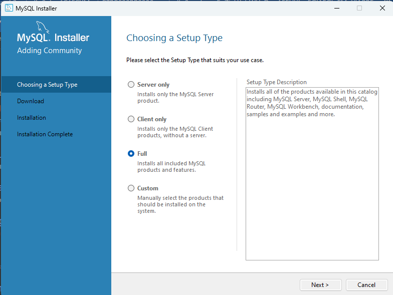
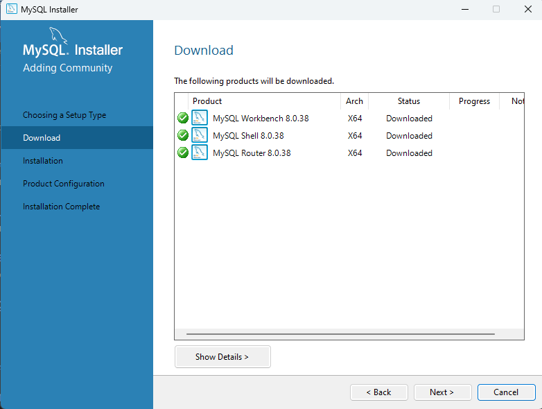
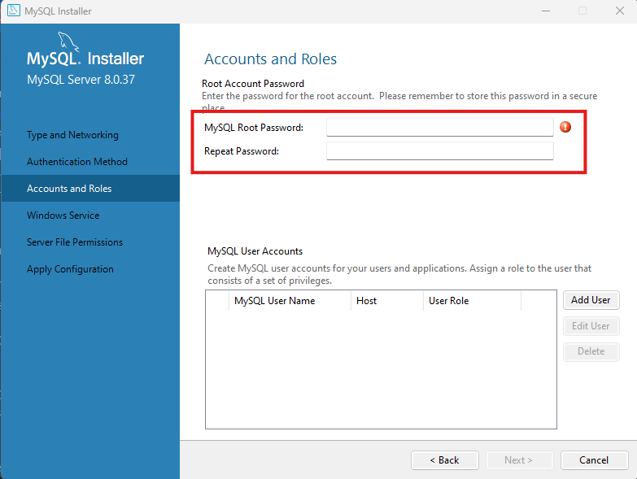
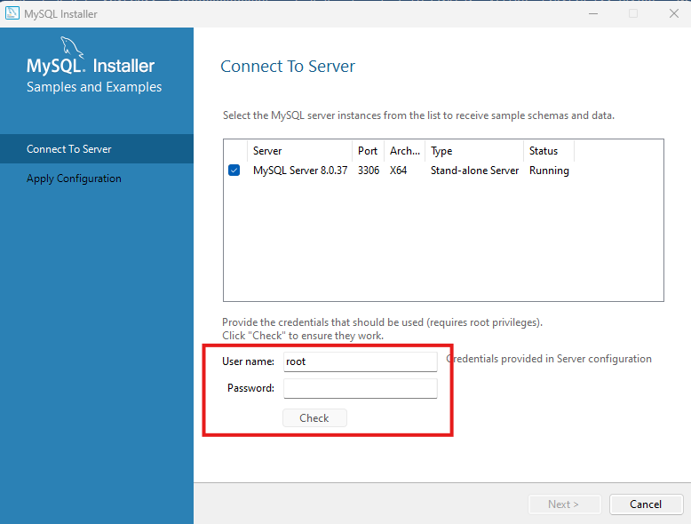
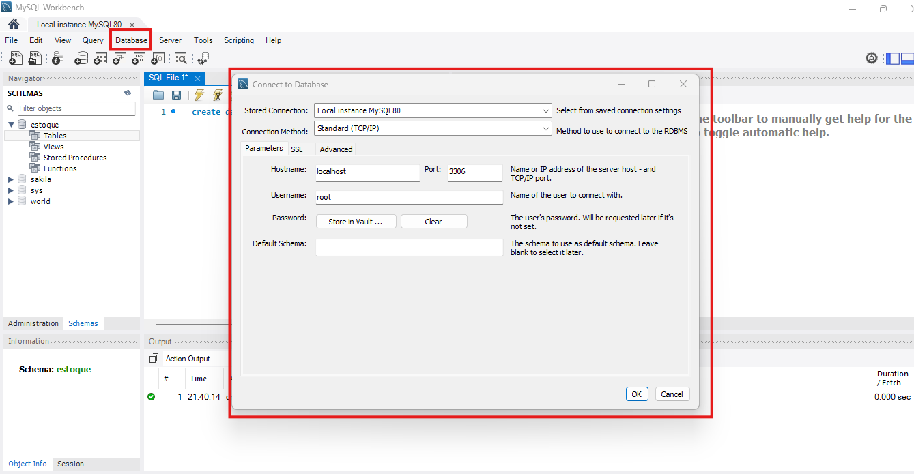
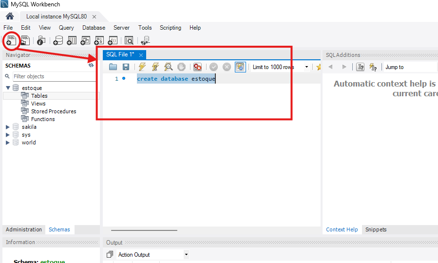
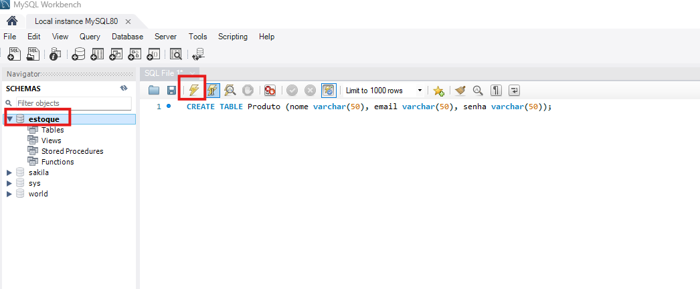
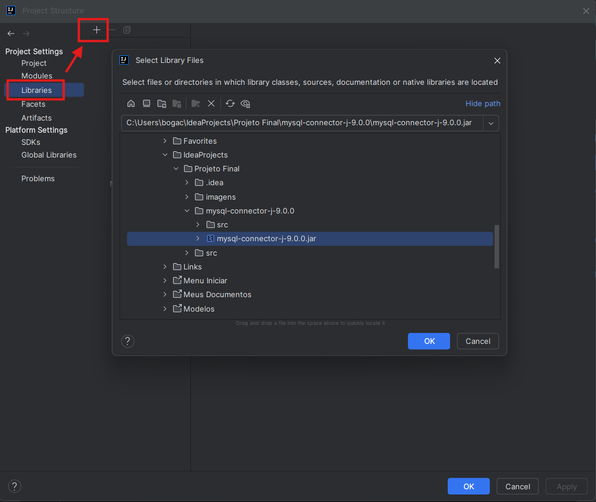

# Projeto Final Curso Java Foundations - 2024/1 SENAI
Professor: Rafael Rodrigues de Oliveira

Como projeto final do curso, foi proposto a criação do seguinte projeto utilizando a linguangem JAVA.

## Sistema de Gerenciamento de Estoque
### Funcionalidades
* #### Cadastro de Produtos
>Permitir o cadastro de produtos com informações como nome, descrição, preço, quantidade em estoque, etc.

* #### Atualização de Estoque
>Funcionalidade para registrar entradas e saídas de produtos do estoque. Controle de estoque mínimo e alertas de reabastecimento.
* #### Consulta e Relatórios
>Tela para consultar produtos disponíveis e histórico de movimentação de
estoque. Geração de relatórios de vendas, produtos mais vendidos, etc.

### Implementação
* #### Interface gráfica Swing para facilitar o cadastro e visualização de produtos e movimentações de estoque.
* #### Banco de dados MySQL para armazenar informações de produtos e registros de movimentação.
* #### Utilização de consultas SQL para buscar informações e atualizar o estoque dos produtos.

## 📋 Gerenciamento do projeto 
Para melhor gerencia a distribuição das atividades foi utilizado o aplicativo [Trello](https://trello.com/b/tfWy59rh/gestao-de-projetos).

## 🚀 Começando
Realize o clone da branch [SENAI_JavaFoundation_ProjetoFinal](https://github.com/jjcomputacao/jjcomputacao/tree/SENAI_JavaFoundation_ProjetoFinal) do projeto para a sua maquina.

### Pré-requisitos
```
- IntelliJ IDEA.
- Instalação do banco de dados.
- Criação do banco, tabela e colunas.
- Connector MySQL
```

### 🔧 Instalação
- Instale [IntelliJ IDEA](https://www.jetbrains.com/idea/download/?section=windows) em sua maquina.
- Realize o download e instale o [mysql](https://downloads.mysql.com/archives/get/p/25/file/mysql-installer-community-8.0.37.0.msi) em sua máquina.

    Selecione a opção Full
  


    Clique no botão "Next > ", depois execute.
    Após o status estiver como "Downloaded", clique no botão "Next > " e logo após em "Execute".
    


    Clique no botão "Next >" até ser solicitado password.
    


    Em MySQL Root Password digite "senaisp", e confirma logo abaixo.
    Continue a instalação e finalize clicando no botão "Finish".
    Ao chegar na tela Connect To Server digite o password "senaisp".
    


    Clique no botão Check e após "Next >", "Execute" e "Finish".
    Após a instalação do mysql, realize a criação do banco, tabela e colunas.
    Abra o MySQL Workbench, e clique em Database > Connect to Database e clique em OK.
    


    Clique em new SQL.
    


    Digite o seguinte comando para criar o bando de dados.
    ```
    CREATE DATABASE estoque
    ```
    Clique em executar comando
    Selecione o banco criado e digite o seguinte comando para criar tabela e Colunas.
    ```
    CREATE TABLE Produto (nome varchar(50), email varchar(50), senha varchar(50));
    ```
    Clique em executar comando
    


    Clique em atualizar o schema e pronto banco criado.
- Realize o download e descompacta o [Connector MySQL](https://dev.mysql.com/downloads/connector/j/) na raiz do projeto.
    Abra o Intelij e Clique em File > Project Structure > Project Settings > Libraries
    Clique em new project Lybrary Java e selecione o arquivo "mysql-connector-j-9.0.0.jar".
  


    Clique em "OK", "Apply" e "OK".

## ⚙️ Executar

Explicar como executar os testes automatizados para este sistema.

## 🛠️ Construído com

* [IntelliJ IDEA](https://www.jetbrains.com/idea/download/?section=windows)
* [MySQL](https://downloads.mysql.com/archives/get/p/25/file/mysql-installer-community-8.0.37.0.msi)
* [Connector MySQL](https://dev.mysql.com/downloads/connector/j/)

## ✒️ Autores

* **Desenvolvedor** - *Jhonatan José da Silva* - [linkedin](https://www.linkedin.com/in/jjcomputacao/)
* **Desenvolvedor** - *Kaue Silva* - [linkedin]()
* **Desenvolvedor** - *Murillo Medina* - [linkedin]()
* **Desenvolvedor** - *Myckael Morais* - [linkedin]()
